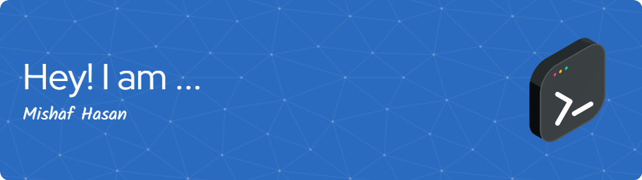

<!-- You can keep your header image, or make it span more of the width if you like -->

  
  <!-- Consider width="100%" if you want it to be responsive,
       but GitHub sometimes has issues with full-width images rendering perfectly.
       A fixed width like 800px or 900px often looks good. -->

<h1 align="center">Hi there, I'm Mishaf Hasan 👋</h1>

<h3 align="center">A passionate Computer Science Student from Uva Wellassa University of Sri Lanka.</h3>

<!-- Profile Views and Social Badges - Centered for a cleaner look -->

  
     <!-- Optional: adds a bit of space -->
  

<!-- Optional: A good quality GIF can be engaging. Centering it can make it a focal point. -->

  

---

### 🚀 About Me

- 🌱 I’m currently pursuing my **Computer Science and Technology degree**, diving deep into the world of software development and new technologies.
- 💻 I'm working on some projects in my free time.
- 👨‍💻 All of my projects are available on [my GitHub Profile](https://github.com/mind-flayers). I'm always excited to collaborate and learn!
- 📫 How to reach me: Drop me an email at **mishaf1106@gmail.com**.
- ⚡ Fun fact: I'm always curious and love exploring new tech trends and AI enthusias.

---

### 🛠️ Languages and Tools

  <!-- I've kept your existing icons as they are good. Centering them makes the section look neater. -->
  
  
  
  
  
  
  
  
  
  
  
  
  
  
  

---

### 🔗 Connect with Me

  Feel free to connect with me on other platforms:
     <!-- Added line breaks for better spacing -->
  <a href="https://twitter.com/mishafhasan" target="_blank">
     <!-- Slightly increased size -->
  </a>    <!-- Spacing -->
     
     
  

---

### 📊 My GitHub Stats

  <!-- Adding a theme can make these look much nicer.
       Popular themes: dracula, radical, merko, gruvbox, tokyonight, onedark, cobalt, synthwave, highcontrast, etc.
       Pick one you like! I've used 'dracula' as an example.
       Also, ensure your username is correct in all URLs. -->
  
     <!-- Separate stats cards for better readability -->
  
    
  

<!-- Optional: Add a footer or a fun quote -->
<!--
---

  <em>"Stay curious, keep learning!"</em>

-->
